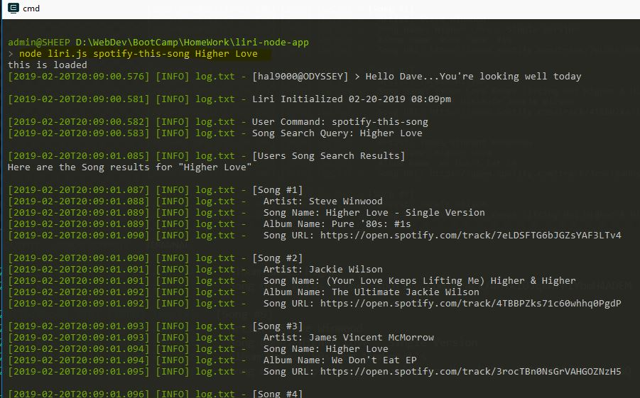

# Liri-Node-App
CLI client that takes in a predefined command that takes in user parameters and calls the corresponding API and returns a result.

## Instructions
**Clone this repo, install node.js and run "node liri.js \<valid command\>"**

**Valid commands are:**
* ***concert-this \<artist/band name\>*** 
   * Will default to "Foo Fighters"
* ***spotify-this-song \<song name\>***
   * Will default to "The Sign" from "Ace of Base"
* ***movie-this \<movie name\>***
   * Defaults to "Mr. Nobody"
* ***do-what-it-says***
   * Pulls from the "random.txt" file which contains a command,query set on each line that gets read in and executed

## Techonologies
* Node
* Express
* MySQL
* HTML
* Bootstrap
* jQuery
* Heroku + JawsDB (for deploying MySQL on Heroku)

## Example Usage
* **No Agruments**

* **concertThis No Args**

* **concertThis with Args**

* **spotifyThis No Args**

* **spotifyThis with Args**

* **movieThis No Args**

* **movieThis with Args**

* **RandomTxtContent**

* **doWhatItSays No Args**  

